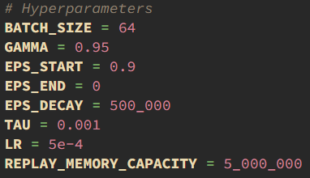

# Tetris-AI

## Demo


## Setup

#### NOTE: The following has been tested with python version 3.10.5 but should work with other recent python versions.

1. Within the project's root directory, create a virtual env with python 

```
    py -m venv env
```

2. Activate virtual env
   
    For command prompt use:
    ```
        venv/Scripts/activate
    ```

    For posix systems use:
    ```
        source env/scripts/activate
    ```

3. Install pip packages in requirements.txt
```
    pip install -r requirements.txt
```

## Watching the AI play

#### _NOTE: Steps 1 and 2 are only necessary if the repository was downloaded directly from github. If the repository was downloaded from an alternative source, the model file 'tetris_model.pth' will have already been packaged with the source code. However, if the model file cannot be found within the root directory then please follow step 1 and onwards._ 

1. Fetch the most recent model file, which will be named 'tetris_model.pth' (the model must be named exactly this),
from the following link:

https://drive.google.com/file/d/129jKWNON0r8tAsmIHw0N6Hr805-Q89Gc/view?usp=sharing

2. Move this model file into the project's root directory.

3. Run test_model.py 
```
    py test_model.py
```
or alternatively, specify the size of the window and play speed:
```
    py test_model.py --size --speed
```

e.g.   

```  
    py test_model.py 8 10
```

If the speed is set to 0, the agent will play as fast as possible. 

e.g.   
```  
    py test_model.py 12 0
```


## Training a new model 

#### _WARNING: The training process can take multiple days to converge and should only be run on a medium to high end graphics card!_

1. Adjust the hyper parameters before starting training. These can be found inside
the train_model.py file:



2. Run train_model.py
```
    py train_model.py
```

3. Optionally view agent learning progress with bash command:

Install tensorboard
```
    pip install tensorboard
```

Then view reward and duration values as graphs

```
    tensorboard --logdir=runs
```

# Playing manually

Run manual_play.py

Controls:

- Left and right arrow keys for horizontal movement
- 'Z' and 'X' keys for anti-clockwise and clockwise rotation respectively
- Spacebar for hard drop
- Down arrow key for soft drop
- Shift to hold a piece
- 'R' key to restart the game

# 40 line clears

Run 40_line_clear.py to see how quickly the model can peform the classic 40
line clear on your machine - the human record is approximately 14 seconds!

Also check how many pieces it takes to do so - 100 pieces is the most 
effiecient way to peform 40 line clears!
